<a href="https://github.com/niranjan910">
  <picture>
    <source media="(prefers-color-scheme: dark)" srcset="hero/dark.svg">
    <source media="(prefers-color-scheme: light)" srcset="hero/light.svg">
    
  </picture>
</a>

<picture>
  <source media="(prefers-color-scheme: dark)" srcset="stats/dark.svg">
  <source media="(prefers-color-scheme: light)" srcset="stats/light.svg">
  
</picture>

